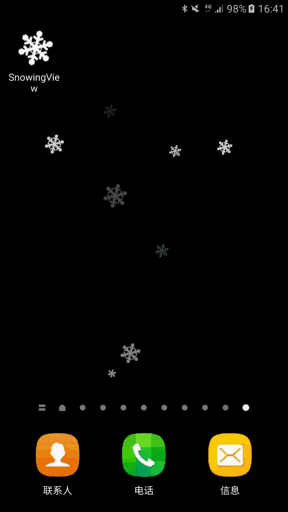

## What's SnowingView ?
It's a dynamic wallpaper with snowing fall down effect and accelerometer sensor. 

## Demo


## 中文介绍
- 三种方式实现雪花掉落效果（原作者的View，我补充的SurfaceView以及WallpaperService）
- 拥有加速度传感器，效果更酷


### About Me

[Weibo](http://weibo.com/WongYuwei)

[Blog](http://www.wangyuwei.me)

### QQ Group 欢迎讨论

**479729938**

##**License**

```license
Copyright [2016] [JeasonWong of copyright owner]

Licensed under the Apache License, Version 2.0 (the "License");
you may not use this file except in compliance with the License.
You may obtain a copy of the License at

    http://www.apache.org/licenses/LICENSE-2.0

Unless required by applicable law or agreed to in writing, software
distributed under the License is distributed on an "AS IS" BASIS,
WITHOUT WARRANTIES OR CONDITIONS OF ANY KIND, either express or implied.
See the License for the specific language governing permissions and
limitations under the License.
```
